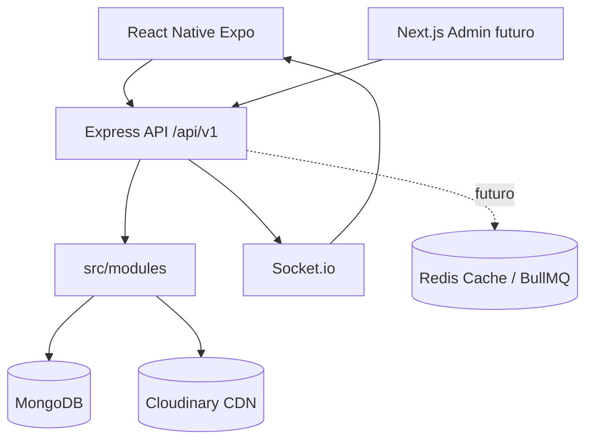

# Arquitectura OneD Social

## Capas

- Routes: definen endpoints y middleware.
- Controllers: adaptación HTTP liviana.
- Services: reglas de negocio reutilizables.
- Models: esquemas Mongoose e índices.
- Validators: contratos Zod.
- Middleware: auth, RBAC, errores, rate limit y sanitización.
